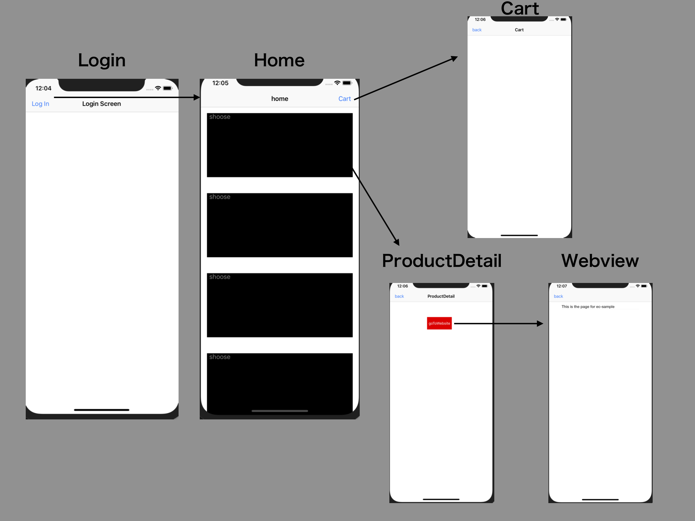

# CRE Sample Application

## Introduction

This repo demonstrates how to setup and use Repro SDK using familliar subject(Ecommerce). 

It basically explains the following functionalities:
 - SDK setup
 
 - Event tracking 
 
 - User profile

 - Webview

 - Push notification
 
 - InApp messaging

## Getting started

This app mainly consists of the four screens:  

 - Splash screen

 - Home Screen
 
 - Detail screen

 - Cart screen

 - Webview screen

## Screen transition

